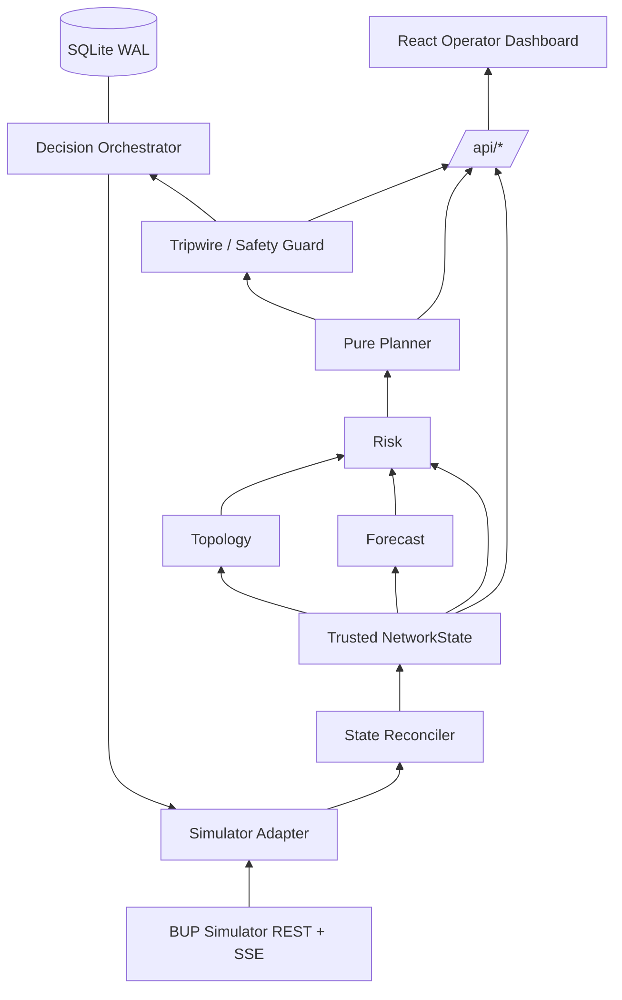

# Architecture

FuelOps AI is a modular monolith: one FastAPI backend and one React operator console. The backend sits
between the BUP simulator and the UI.

```
OBSERVE            UNDERSTAND          PREDICT                     DECIDE          ACT SAFELY
Simulator Adapter → State Reconciler → Forecast + Topology + Risk → Pure Planner → Tripwire → Decision Orchestrator
  app/simulator      app/state          app/intelligence              app/intelligence  app/safety  app/decision
```



## Rules that hold everywhere

- **REST is the source of truth.** SSE only means "something changed, re-read REST".
- **Only `app/simulator/` knows simulator URLs.** Everything else uses `NetworkState` (`app/domain/models.py`).
- **Intelligence is pure.** `app/intelligence/` never does HTTP, DB, wall clock, or global state. `build_plan(state, policy)`
  is deterministic and runs from a fixture without a server.
- **Planning never depends on `/admin/*`.** Admin endpoints are for tests, demos, and benchmarks only.
- **Nothing untrusted is shown as live.** Snapshot freshness is FRESH / STALE / TORN / UNAVAILABLE / RESET_UNCERTAIN / DEGRADED
  (plus FIXTURE for recorded data). A critical Tripwire blocks all automatic execution.
- **Execution is idempotent and serialized per depot.** Persist the intent and key before POST; retry with the same key and body.
- **The frontend computes nothing.** Forecasts, risk, routes, and quantities all come from the API.

## Dependency direction

`web → /api/*` · `api/routes → state, intelligence, safety, decision` · `state → simulator` · `intelligence → domain only`.
Never the reverse.

## Where "AI" actually is

Forecast calibration and drift detection are predictive intelligence. Topology is a graph lookup. The order-up-to
planner is an operations-research heuristic. The Tripwire is a deterministic safety system. Idempotency is
reliability engineering. We present them under those names.

## Decisions

- Storage: SQLite in WAL mode via async SQLAlchemy, on the `fuel_data` volume. Alembic migrations arrive with real tables.
  This supersedes the PostgreSQL choice in `specs/0001`.
- Contracts: Pydantic models → FastAPI OpenAPI (`apps/web/src/api/generated/openapi.json`) → generated TypeScript
  (`schema.d.ts`). Never hand-copy types.
- Browser updates: poll `GET /api/dashboard` every 2 s.
